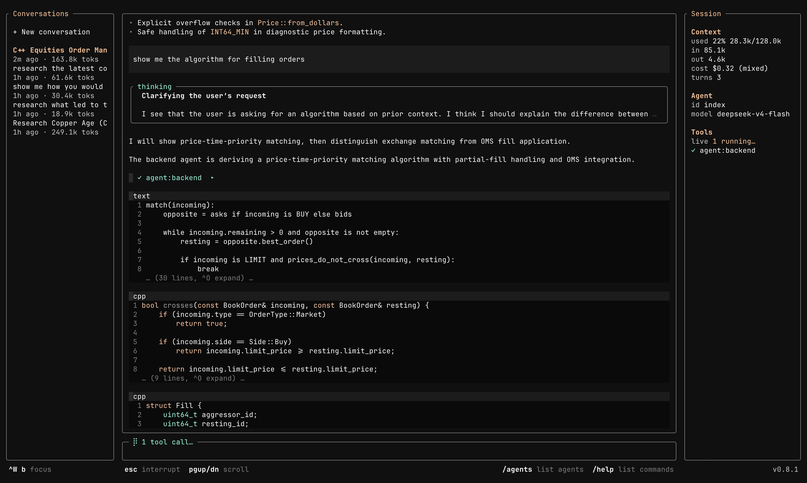

# Arbiter




**A local agent runtime in a single native binary.** Run multi-agent workflows on your machine — interactive TUI, one-shot CLI, or HTTP+SSE — with hard tool allowlists and a shared streaming event bus. Local-first; network is optional.

Not a library. Not a hosted platform. A process you run.

## Quick start

```bash
# Install (macOS arm64)
curl -L https://github.com/tylerreckart/arbiter/releases/latest/download/arbiter-macos-arm64.tar.gz \
  | tar xz -C /usr/local/bin

export OPENROUTER_API_KEY="sk-or-..."   # or use Ollama — see docs
arbiter --init                          # seed starter agents under ~/.arbiter/
arbiter                                 # open the TUI
```

Linux binaries, source builds, Ollama, `--send`, and `--api` are in
[getting-started/local](docs/getting-started/local.md).

## Same agents, three faces

| Mode | Command | For |
|------|---------|-----|
| Interactive | `arbiter` | Multi-pane TUI, persistent per-cwd sessions |
| One-shot | `arbiter --send <agent> "..."` | Scripts, cron, CI |
| Server | `arbiter --api` | HTTP+SSE API, tenant-isolated, A2A v1.0 |

One binary. Shared storage under `~/.arbiter/`. Provider keys (OpenRouter, Ollama, …) are the only external dependency for model calls.

## Why run it

**Own the harness.** Orchestrate specialists, durable memory, and tool use without duct-taping a chat CLI to FastAPI and SQLite. The runtime stays thin; agent behavior lives in constitutions (JSON: model, role, rules, tool allowlist).

**Hard limits, not prompt suggestions.** Every agent's tool surface is an allowlist checked at dispatch. Optional advisor gate: a second model signs off before consequential turns reach you.

**One event model everywhere.** The orchestration loop streams the same SSE-shaped events the TUI already consumes — text, tool calls, files, sub-agent responses, done. API clients get that stream over the wire; durable request logs make reconnect and replay possible.

**Route work in, don't write a dispatcher.** Webhooks, queues, firmware, and sensors can `POST /v1/events`; declare a glob per agent and Arbiter routes matching events there.

## Design in one line

Process-local multi-agent orchestration with a prose-embedded command DSL, shared storage, and a streaming event bus exposed as TUI / CLI / HTTP.

Deeper tradeoffs — why commands are inline rather than JSON tool-calling, why ops (TLS, WAF, rate limits) stay at the reverse proxy, how memory and tenants work — are in [`docs/philosophy`](docs/philosophy.md).

## Themeable

38 presets ship in the box (Nord, Dracula, Catppuccin, Gruvbox, Tokyo Night, Solarized, and more);
export one as a starting point and edit hex values to make your own:

```bash
arbiter --export-theme high-contrast > ~/.arbiter/themes/mine.json
```

```
/theme list           # built-in presets + your custom themes
/theme mine           # switch instantly, no restart
/theme save mine      # write the current look back to disk
```

Backgrounds, text, borders, markdown and diff syntax colors, even the
12-color agent palette are all keyed in one schema — down to the padding
and column breakpoints. Full reference in
[`docs/tui/themes.md`](docs/tui/themes.md).

## Documentation

- [`docs/getting-started`](https://arbiter.run/docs/getting-started/local) — first agent reply
- [`docs/philosophy`](https://arbiter.run/docs/philosophy) — why Arbiter is shaped this way
- [`docs/api/`](https://arbiter.run/docs/api) — HTTP API, tenants, SSE, MCP, A2A, memory
- [`docs/cli/`](https://arbiter.run/docs/cli) — `--init`, `--send`, `--api`, env vars
- [`docs/tui/`](https://arbiter.run/docs/tui) — panes, keybindings, themes, sessions
- [`ROADMAP.md`](ROADMAP.md) — feature audit, competitive gaps, and phased plan toward 1.0
- [`CHANGELOG.md`](CHANGELOG.md) · [`CONTRIBUTING.md`](CONTRIBUTING.md) · [`SECURITY.md`](SECURITY.md)

Arbiter is experimental. The event surface, agent constitutions, and HTTP shape may change. `/exec` is unsandboxed by default; treat it accordingly.

Licensed under the [Apache License 2.0](LICENSE).
