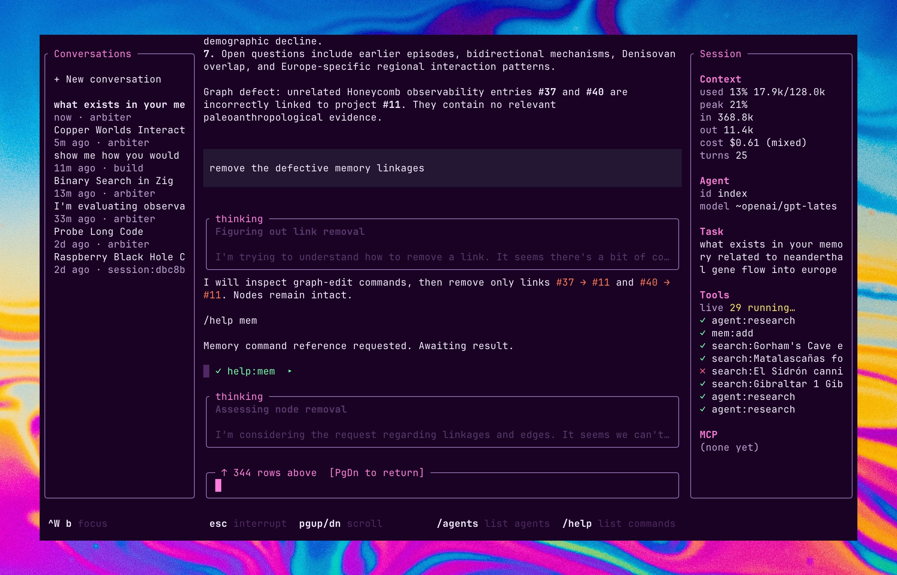

# Arbiter




Native reasoning runtime for agents. Compile once, run anywhere. Laptops, servers,
edge boxes, or CI runners. Feed it prompts, webhooks, or events from firmware and sensors and
it reasons, delegates to specialist sub-agents, acts through a constrained
tool surface, and streams every step back as structured SSE in a native TUI, HTTP API, and one-shot CLI.

## Quick start

```bash
# Install (macOS arm64)
curl -L https://github.com/tylerreckart/arbiter/releases/latest/download/arbiter-macos-arm64.tar.gz \
  | tar xz -C /usr/local/bin

# Launch the terminal client
arbiter
```

Linux binary, source builds, OpenRouter/Ollama setup, the API server, and
one-shot mode are in [getting-started/local](docs/getting-started/local.md).

## Documentation

- [`docs/getting-started`](https://arbiter.run/docs/getting-started/local) —
  quickstart paths to first agent reply.
- [`docs/philosophy`](https://arbiter.run/docs/philosophy) — design
  philosophy: the six themes that explain why arbiter is shaped the way it is.
- [`docs/api/`](https://arbiter.run/docs/api) — full HTTP API reference:
  tenants, auth, SSE events, fleet streaming, MCP, A2A, artifacts, memory,
  operations, and one page per endpoint.
- [`docs/cli/`](https://arbiter.run/docs/cli) — non-interactive command-line
  reference: `--init`, `--setup-tools`, `--send`, `--api`, tenant admin, environment variables.
- [`docs/tui/`](https://arbiter.run/docs/tui) — interactive terminal client:
  screen anatomy, slash commands, keybindings, multi-pane layouts, streaming
  and turn lifecycle, session persistence.
- [`CHANGELOG.md`](CHANGELOG.md) — what changed, when. Breaking changes are
  flagged.
- [`CONTRIBUTING.md`](CONTRIBUTING.md) — build, tests, PR conventions.
- [`SECURITY.md`](SECURITY.md) — disclosure path for security
  vulnerabilities and operator hardening notes.

Arbiter is experimental. The event surface, agent constitutions, and HTTP
shape are subject to change. `/exec` is unsandboxed by default; treat it
accordingly.

## Run it anywhere

Same agent, three interfaces:

| Where | How |
|-------|-----|
| Locally | `arbiter` — interactive multi-pane TUI, persistent per-cwd sessions |
| A script or cron job | `arbiter --send <agent> "..."` — one-shot dispatch |
| Your stack | `arbiter --api` — HTTP+SSE server, tenant-isolated, speaks A2A v1.0 |
| A device or robot | `POST /v1/events` from firmware or a bridge — the device sends a request, arbiter does the reasoning |
| A webhook or queue | Declare a glob pattern per agent and arbiter routes matching events there — no dispatcher to write |

No runtime to install beyond the binary itself. Provider keys (OpenRouter,
Ollama, etc.) are the only external dependency for model calls.

## What it does

**Orchestrate any task.** Send a prompt from the TUI, CLI, or HTTP
API. The runtime fans work out to specialist agents, consults durable
memory, and streams the full reasoning trace back to the caller.

**Route events from software and hardware.** Turn GitHub webhooks, incident
feeds, sensor readings, and edge telemetry into supervised agent runs.
Declare which event types an agent handles; arbiter matches and routes
without a hand-written dispatcher.

**Act with supervision.** Every agent's tool access is a hard allowlist, not
a suggestion in the system prompt. Layer an advisor gate on top and
consequential turns get a second model's sign-off before they reach you.

## Themeable

18 presets ship in the box (Nord, Dracula, Catppuccin, Gruvbox, Tokyo Night, Solarized, and more); 
export one as a starting point and edit hex values to make your own:

```bash
arbiter --export-theme onedark > ~/.arbiter/themes/mine.json
```

```
/theme list           # built-in presets + your custom themes
/theme mine           # switch instantly, no restart
/theme save mine      # write the current look back to disk
```

Backgrounds, text, borders, markdown and diff syntax colors, even the
12-color agent palette are all keyed in one schema — down to the padding
and column breakpoints. Full reference in
[`docs/tui/themes.md`](docs/tui/themes.md).


Licensed under the [Apache License 2.0](LICENSE).
