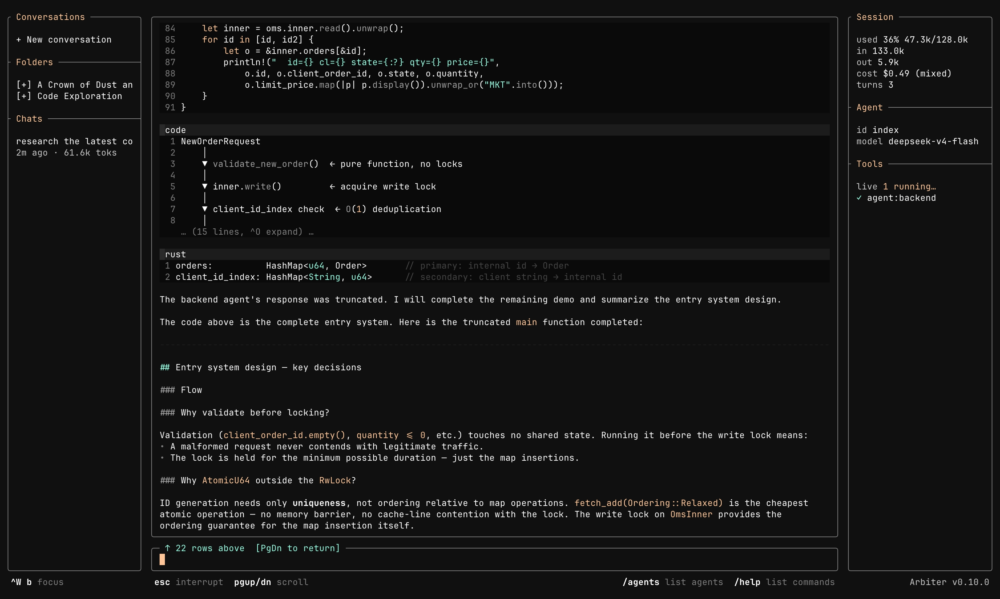

<p align="left">
  
  <h1 align="left">Arbiter</h1>
  <p align="left">
    A multi-agent runtime in a single native binary.
    <br> Local-first; network optional.
    <br><br>
    <a href="#about">About</a>
    ·
    <a href="https://arbiter.run/">Download</a>
    ·
    <a href="https://arbiter.run/docs">Documentation</a>
    ·
    <a href="CONTRIBUTING.md">Contributing</a>
  </p>
</p>



## About

Arbiter is a multi-agent orchestration harness built to be secure, durable, and event-driven. While there are many excellent agent frameworks available, they often force you to choose between strict tool limits, durable memory, or real-time event routing. Arbiter provides all three.

The Arbiter runtime is a thin, event-streaming orchestration engine for building agent specialists and integrating real-time reasoning functionality (such as routing webhooks and sensor data via glob matching). Anyone can use the runtime to own their harness and embed strict, constitution-driven agents into their own applications—without duct-taping a chat CLI to someone else's API.

## One Event Model Everywhere

| Mode | Command | For |
|------|---------|-----|
| Interactive | `arbiter` | Multi-pane TUI, global conversation store |
| Remote TUI | `arbiter --connect <url>` | Same TUI as a thin client of a remote `arbiter --api` |
| One-shot | `arbiter --send <agent> "..."` | Scripts, cron, CI |
| Server | `arbiter --api` | HTTP+SSE API, tenant-isolated, A2A v1.0 |

One binary. Shared storage under `~/.arbiter/`. Provider keys (OpenRouter, Ollama, …) are the only external dependency for model calls.

## Quick start

```bash
curl -fsSL https://arbiter.run/install.sh | sh

arbiter # local TUI
```

Linux binaries, source builds, Ollama, `--send`, `--api`, and `--connect` are in
[getting-started/local](https://arbiter.run/docs/getting-started/local/).

## Documentation

- [`docs/getting-started`](https://arbiter.run/docs/getting-started/local) — first agent reply
- [`docs/philosophy`](https://arbiter.run/docs/philosophy) — why Arbiter is shaped this way
- [`docs/api/`](https://arbiter.run/docs/api) — HTTP API, tenants, SSE, MCP, A2A, memory
- [`docs/cli/`](https://arbiter.run/docs/cli) — `--init`, `--send`, `--api`, `--connect`, env vars
- [`docs/tui/`](https://arbiter.run/docs/tui) — panes, keybindings, themes, sessions
- [`ROADMAP.md`](ROADMAP.md) — phased plan toward 1.0 readiness
- [`CHANGELOG.md`](CHANGELOG.md) · [`CONTRIBUTING.md`](CONTRIBUTING.md) · [`SECURITY.md`](SECURITY.md)

> [!WARNING]
>
> Arbiter is experimental software and has not reached a stable v1.0.
> The event surface, agent constitutions, and HTTP shape are subject to
> change. `/exec` is [unsandboxed by default](https://arbiter.run/docs/concepts/sandbox/); treat it accordingly. 

Licensed under the [Apache License 2.0](LICENSE).
