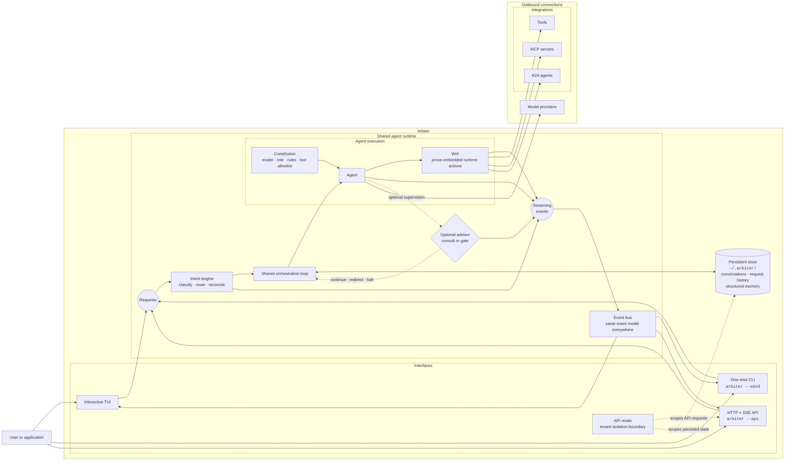

# High-Level Architecture

Arbiter is distributed as a single native binary with three user-facing modes: an interactive TUI, a one-shot CLI, and an HTTP + SSE API.

The following diagram provides a conceptual overview of how these interfaces share the same orchestration runtime, event model, persistent state, agent configuration, and outbound integrations.

This overview intentionally omits implementation details and focuses on the conceptual relationships between Arbiter's major architectural components.

## Related concepts

For implementation details and deeper explanations, see:

- [Writ](writ.md)
- [Intent](intent.md)
- [Reconcile](reconcile.md)
- [Advisor](advisor.md)
- [Structured memory](structured-memory.md)
- [MCP](mcp.md)
- [A2A](a2a.md)
- [Voice](voice.md)
- [Tenants](tenants.md)
- [SSE events](sse-events.md)
