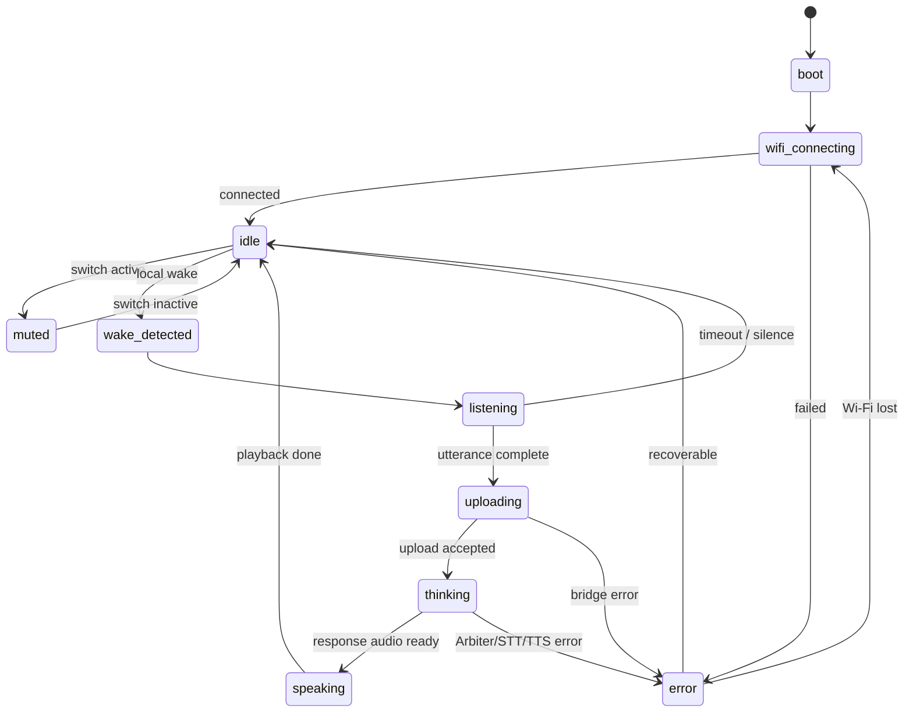

# 3bo firmware design

Firmware owns the physical robot loop: local wake, mute, microphone capture, camera frame capture and forwarding, bridge communication, speaker playback, LEDs, and recovery. It has no knowledge of Arbiter tenant tokens, model provider keys, STT credentials, or TTS credentials — those live on the Jetson Orin in the bridge service.

## Firmware tracks

| Track | Build system | Purpose |
| --- | --- | --- |
| Arduino bench firmware | Arduino IDE / Arduino CLI | Bring up the current hardware: Wi-Fi, mute, NeoPixels, I2S mic, I2S amp, bridge upload, WAV playback. |
| ESP-IDF production firmware | ESP-IDF with ESP-SR | Real wake-word implementation with WakeNet/AFE, VAD, better buffering, diagnostics, and OTA. |

Arduino is the fastest path to end-to-end audio. ESP-IDF is the right long-term home because Espressif's ESP-SR WakeNet/AFE stack requires that environment.

## Audio format

| Field | Value |
| --- | --- |
| Container | WAV for v1, raw PCM allowed later |
| Sample rate | 16000 Hz |
| Channels | 1 mono |
| Sample format | signed 16-bit little-endian PCM |
| Max utterance | 4-8 seconds for bench firmware |

The ICS-43434 emits I2S audio in wider slots at higher resolution. Convert to 16 kHz mono signed 16-bit before wake inference and before bridge upload.

## I2S strategy

Use the I2S bus in one active direction at a time:

1. Idle/listening: configure I2S RX for the ICS-43434 microphone.
2. Upload/thinking: stop I2S while Wi-Fi posts to the Jetson bridge.
3. Speaking: configure I2S TX for the MAX98357A amplifier.
4. Return to idle: stop TX and reconfigure RX.

This avoids full-duplex clocking surprises during hardware bring-up. The ESP32-S3 can support richer I2S arrangements later, but sequential RX/TX matches the first product behavior: 3bo does not accept a new wake word while it is already speaking.

## State machine



State ownership stays local. The bridge can request high-level state changes, but firmware clamps those to known states and patterns.

## Wake provider interface

Wake detection is a replaceable provider:

```cpp
struct WakeResult {
  bool detected;
  float confidence;
};

class WakeProvider {
 public:
  void begin();
  WakeResult feed(const int16_t *samples, size_t sample_count);
  void setMuted(bool muted);
};
```

Bench firmware uses a serial test trigger or a crude energy trigger so the rest of the robot loop is testable. Product firmware replaces that with ESP-SR WakeNet through ESP-IDF. WakeNet expects 16 kHz mono signed 16-bit audio, so the audio conversion layer is shared by both paths.

## Buffering

| Buffer | Size target | Purpose |
| --- | --- | --- |
| Wake frame | 30 ms | Matches WakeNet's feature frame cadence. |
| Pre-roll | 500-1000 ms | Captures the beginning of the user's sentence after wake. |
| Utterance ring | 4-8 seconds | Avoids one large blocking allocation. |
| Playback chunk | 512-2048 bytes | Smooth I2S TX without large RAM spikes. |

The Nano ESP32 has PSRAM, so a small in-memory WAV is acceptable for the bench prototype. Move to ring-buffered streaming once the bridge and audio path are stable.

## Bridge protocol

### Blocking v1

The current firmware posts to the Jetson bridge over Wi-Fi/HTTP:

```http
POST /v1/utterance HTTP/1.1
Authorization: Bearer <THREEBO_DEVICE_SECRET>
Content-Type: audio/wav
Content-Length: <bytes>
```

The Nano's `THREEBO_BRIDGE_BASE_URL` points at the Jetson on the local network, for example `http://3bo.local:8081` or the Jetson's LAN IP.

The bridge returns:

```http
200 OK
Content-Type: audio/wav
Content-Length: <bytes>
```

Return 16 kHz mono signed 16-bit PCM WAV audio. Keep TTS amplitude low; the MAX98357A can overpower a 0.2 W speaker. Reject missing or invalid `Authorization: Bearer` header before running STT, TTS, or Arbiter. Add bridge-side request size limits, per-device rate limits, and a short upload timeout so a LAN client cannot turn the robot into an open compute/audio proxy.

### USB serial product path

> **Not yet implemented.** The framing protocol below is the target design for Milestone 4. The current v1 firmware uses the Wi-Fi/HTTP path only.

The preferred Nano-to-Jetson connection is USB CDC serial over the same USB-C cable that powers the Nano. The Jetson bridge opens the Nano device (usually `/dev/ttyACM0`) and exchanges framed messages.

```text
magic:       "3BO1"
type:        1 byte  // state, utterance.chunk, utterance.done, speech.chunk, frame, error
flags:       1 byte
length:      uint32 little-endian payload bytes
payload:     length bytes
crc32:       uint32 little-endian over header + payload
```

The `frame` message type carries a JPEG-compressed camera frame from the OV5640. The ESP32-S3 captures frames via its parallel DVP camera peripheral (`esp32-camera` library), JPEG-compresses them, and emits one `frame` message per captured image. The Jetson vision service reads these from the serial port to feed MediaPipe and the `/frame` HTTP endpoint.

Start with small `state` and telemetry frames. Add utterance chunks once serial framing, retries, and bridge logging are stable. Mirror the HTTP auth concept by pairing the device secret during session setup.

### Streaming v2 (M4 design, not implemented)

| Event | Payload | Firmware behavior |
| --- | --- | --- |
| `state` | `{ "state": "thinking" }` | Switch LED pattern. |
| `speech.chunk` | WAV/PCM bytes or URL | Queue playback. |
| `speech.done` | `{}` | Return to idle after queue drains. |
| `error` | `{ "message": "..." }` | Error LED and recovery. |

Streaming lets the bridge start speaking sentence chunks while Arbiter is still finishing the answer.

## LED policy

| State | Pattern |
| --- | --- |
| `boot` | short white fill |
| `wifi_connecting` | blue rotating pixel |
| `idle` | low white breath |
| `wake_detected` | quick white flash |
| `listening` | blue pulse |
| `uploading` | blue chase |
| `thinking` | amber sweep |
| `speaking` | white/green voice meter or pulse |
| `muted` | dim red |
| `error` | red blink |

Keep maximum brightness low until the Jetson USB-powered 5 V body budget is measured under load.

## Error handling

- If Wi-Fi disconnects, stop audio capture and show `wifi_connecting`.
- If the Jetson bridge upload fails, show `error`, wait briefly, then return to idle.
- If playback audio is too large or lacks `Content-Length`, reject it and log the reason.
- If mute becomes active during recording, discard the utterance.
- If mute becomes active during speaking, stop playback when the audio layer supports interruption; for the bench sketch, finish the current blocking playback at low volume.
- Hardware mute must also remove microphone power. Firmware mute handling is a second layer for state and UX, not the privacy boundary.
- If audio init fails, keep the device in `error` and report over serial.

## Configuration

Firmware configuration contains only device-local settings:

- Wi-Fi SSID and password.
- Jetson bridge base URL.
- Device ID.
- Per-device bridge secret.
- LED brightness cap.
- Max recording duration.
- Optional development wake trigger.

Do not place Arbiter tenant tokens, provider API keys, or bridge admin secrets in firmware. The per-device bridge secret is only a device-pairing credential for the local bridge; rotate it if the firmware image is shared.

## Development order

### Completed (M1–M2)

1. Bring up the Jetson Orin with JetPack, cooling, storage, network, SSH, and system updates.
2. Build Arbiter on the Jetson and run `arbiter --api` on localhost.
3. Run a local STT smoke test on the Jetson with a saved 16 kHz WAV file.
4. Run a local TTS smoke test and confirm output is 16 kHz mono WAV.
5. Flash the Arduino bench firmware with Wi-Fi and LED animation only.
6. Add I2S TX and play a quiet WAV/tone through the MAX98357A.
7. Add I2S RX and print microphone levels.
8. Upload a fixed-duration WAV from the Nano to the Jetson bridge.
9. Have the Jetson bridge return a small WAV and play it.
10. Enforce the bridge shared secret, body-size cap, and per-device rate limit.

### Remaining (M3–M4)

11. Add VAD and pre-roll.
12. Port the wake provider to ESP-IDF + ESP-SR WakeNet.
13. Add streaming playback and OTA.

## Source references

- Arduino Nano ESP32 documentation: https://docs.arduino.cc/hardware/nano-esp32/
- Arduino Nano ESP32 store/spec page: https://store.arduino.cc/products/nano-esp32
- Arduino-ESP32 I2S API: https://docs.espressif.com/projects/arduino-esp32/en/latest/api/i2s.html
- ESP-IDF I2S programming guide: https://docs.espressif.com/projects/esp-idf/en/latest/esp32s3/api-reference/peripherals/i2s.html
- ESP-SR WakeNet documentation: https://docs.espressif.com/projects/esp-sr/en/latest/esp32s3/wake_word_engine/README.html
- NVIDIA Jetson Orin Nano Super Developer Kit: https://www.nvidia.com/en-us/autonomous-machines/embedded-systems/jetson-orin/nano-super-developer-kit/
- whisper.cpp: https://github.com/ggml-org/whisper.cpp
