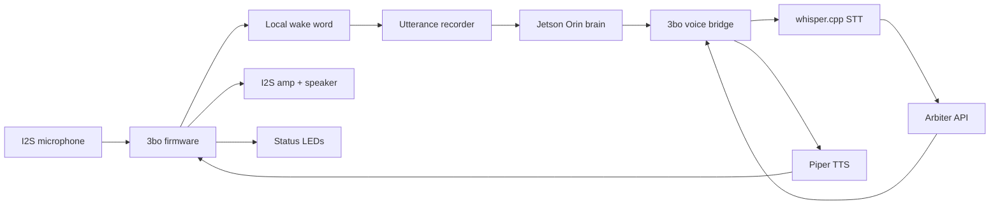
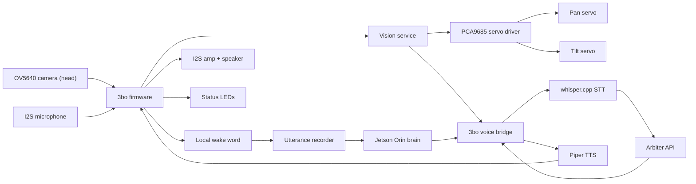

# 3bo

Small stationary robot. An Arduino Nano ESP32 handles the physical interface:
I2S microphone capture, wake-word detection, LED states, and speaker playback.
A Jetson Orin Nano runs whisper.cpp for STT, Piper for TTS, Arbiter for
reasoning, and the voice bridge that connects them. The Nano connects to the
Jetson over a single USB-C cable that carries both power and serial data.

Cloud provider keys and Arbiter tenant tokens never leave the Jetson. The
firmware holds only a per-device bridge secret used as a Bearer token.

The v1 build has no servos or camera. Build servo pockets into the v1 enclosure
for the M5 upgrade path. See [VISION.md](VISION.md) for the full design.

## Documents

| File | Contents |
| --- | --- |
| `BOM.md` | Component list with part numbers and cost estimates |
| `CIRCUIT.md` | Bench wiring tables and bring-up order |
| `FIRMWARE.md` | Arduino firmware architecture, state machine, and bridge protocol |
| `JETSON.md` | Step-by-step Jetson setup: Arbiter, Ollama, whisper.cpp, Piper, bridge |
| `VISION.md` | M5 design spec: USB camera, pan/tilt neck, face tracking, VLM queries |
| `agents/` | Example Arbiter agent constitutions (event monitor) |
| `bridge/` | 3bo bridge launcher and hardware bring-up stub |
| `firmware/arduino/` | Arduino bench firmware sketch |

## System architecture

**M5 addition** — USB camera and vision service on the Jetson; pan/tilt neck
and motorised base driven by PCA9685 over I2C.

## Hardware

| Part | Example | Purpose |
| --- | --- | --- |
| Local brain | NVIDIA Jetson Orin Nano Super Developer Kit | Bridge, Arbiter, STT, TTS, storage |
| Controller | Arduino Nano ESP32 | Wake word, I2S mic/amp, LEDs, mute |
| Microphone | Adafruit ICS-43434 I2S MEMS mic breakout, product 6049 | Digital mono speech capture |
| Amplifier | Adafruit MAX98357A I2S amplifier, product 3006 | Speaker playback |
| Speaker | Adafruit 3" 8 ohm 1 W speaker, product 1313 | Audio output |
| LEDs | Adafruit NeoPixel Jewel 7 × RGBW, product 2858 | Robot eye / state display |
| Mute | DPDT switch + P-channel MOSFET or load switch | Hard microphone power cutoff |

Power rules:
- Jetson: vendor-recommended supply or a dedicated regulator on the 19 V input rail.
- Nano ESP32: powered from the Jetson USB host port only. Do not connect `VIN`.
- LEDs and amp: 5 V USB-powered load. Stay within the verified current budget.
- Microphone: 3.3 V only. Route through the mute switch so mute cuts mic power.

See [BOM.md](BOM.md) for the full parts list and [CIRCUIT.md](CIRCUIT.md) for wiring.

## Robot states

| State | LED | Audio | Head (M5 only) |
| --- | --- | --- | --- |
| `idle` | Soft white breath | Wake-word listening | Rest pose (0°, −5°) |
| `wake_detected` | Quick white flash | Optional earcon | — |
| `scanning` | Amber sweep | Silent | Pan ±45° searching for face |
| `listening` | Blue pulse | Recording | Tracking on locked face |
| `uploading` | Blue chase | Optional tick | Tracking |
| `thinking` | Amber sweep | Silent | Tracking |
| `speaking` | White/green meter | TTS playback | Tracking |
| `error` | Red blink | Short error phrase | Rest pose |
| `muted` | Dim red | Wake-word disabled | Rest pose |

`scanning` and tracking are M5 additions. The v1 state machine has no
`scanning` state and no servo output.

## LED patterns

| Pattern | Trigger |
| --- | --- |
| `breath_idle` | Online, wake-word active |
| `wake_flash` | Wake word detected |
| `listen_pulse` | Recording utterance |
| `upload_chase` | Uploading to bridge |
| `think_sweep` | Waiting for response |
| `speak_meter` | Speaking, brightness tracks audio level |
| `error_blink` | Any failure |
| `muted_dim` | Microphone muted |

## Privacy

- Mute switch cuts microphone 3.3 V through a hardware pole or load switch.
- Firmware mute is a state signal only — privacy depends on the hardware path.
- Arbiter tokens and provider keys stay on the Jetson; firmware stores only the per-device bridge secret.
- Audio is not sent to the bridge before wake-word detection triggers.
- The bridge enforces auth, body-size limits, and per-IP rate limits before invoking STT, TTS, or Arbiter.

## Prototype milestones

### Milestone 1: Software loop

See [JETSON.md](JETSON.md) for the full step-by-step setup.

- Bring up Jetson with JetPack 6, cooling, and SSH.
- Build Arbiter; provision a tenant token; confirm `/v1/health`.
- Install Ollama; pull `gemma3:4b`; register the `local` agent.
- Build whisper.cpp with CUDA; download `ggml-base.en.bin`.
- Install Piper; download `en_US-amy-low.onnx`.
- Run bridge stub; confirm auth rejection and canned WAV playback with the Nano.
- Switch to `bridge.py`; confirm `/v1/transcribe` and `/v1/utterance` return correct output.

### Milestone 2: Audio and LED loop

- Connect I2S microphone and speaker.
- Connect NeoPixel stick.
- Record a fixed-length utterance and upload to the bridge.
- Play back the TTS WAV response.
- Verify LED states for each robot state.

### Milestone 3: Wake word

- Add ESP-SR WakeNet or equivalent on-device wake-word engine.
- Replace fixed recording with wake-triggered recording.
- Add VAD silence detection and max-duration cutoff.
- Wire the hard microphone mute switch.

### Milestone 4: Product hardening

- USB CDC serial framing between Nano and Jetson (replacing Wi-Fi fallback).
- OTA firmware update path.
- Bridge-side diagnostic logs.
- Recovery behavior for Wi-Fi, STT, TTS, and Arbiter failures.

### Milestone 5: Vision and head tracking

See [VISION.md](VISION.md) for the full design.

- USB camera on head tier; vision service on Jetson.
- PCA9685 over Jetson I2C; pan/tilt MG90S servos; N20 base motor with DRV8833 and slip ring.
- Face detection at 20–30 fps; two-stage PID tracking (head pan fine, base yaw coarse).
- `scanning` state on wake: ±45° pan sweep until face locked.
- Visual query path: `needs_vision()` → capture frame → moondream2 → prepend to Arbiter message.

## Open decisions

- Wake word engine: ESP-SR WakeNet, Picovoice Porcupine, or custom TinyML.
- Scanning idle (M5): static rest pose vs. slow ambient scan — measure under load before deciding.
